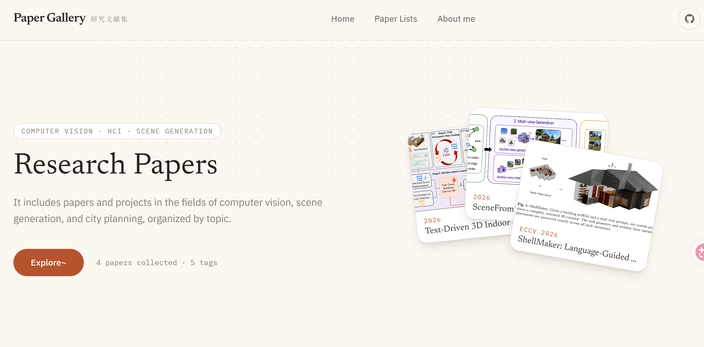

# Paper Gallery

一个用于收录计算机视觉、城市规划与场景生成方向论文的个人学术收录网站。

**[🔗 在线预览 →](https://StarryNmy.github.io/paper-gallery/)**

## 简介

- 按标签（CVPR / NeurIPS / arXiv / 开源项目）筛选论文
- 支持标题、摘要、标签的实时搜索
- 数据驱动：不定时更新

<!-- ## 技术栈

React · Tailwind CSS · 纯静态部署（无构建流程） -->

## License

MIT